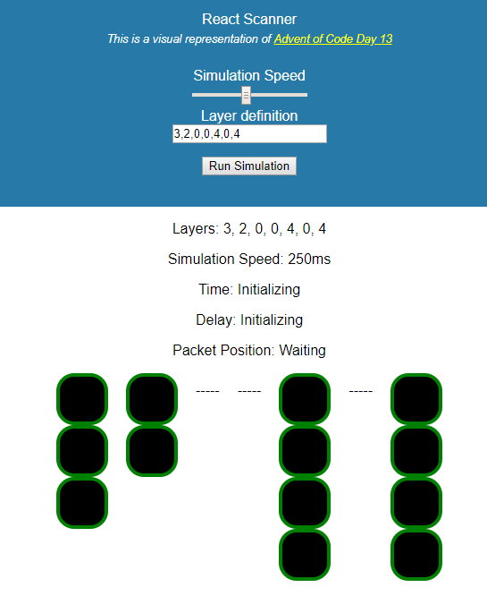

This is a visual representation of https://adventofcode.com/2017/day/13 build in react

### Usage
Play with it online at: https://codepen.io/MichaelNZ404/pen/zjOmqp

OR

Run `npm install` and `npm start`
visit `http://localhost:3000/`

### Project Description
You need to cross a vast firewall. The firewall consists of several layers, each with a security scanner that moves back and forth across the layer. To succeed, you must not be detected by a scanner.

By studying the firewall briefly, you are able to record (in your puzzle input) the depth of each layer and the range of the scanning area for the scanner within it, written as depth: range. Each layer has a thickness of exactly 1. A layer at depth 0 begins immediately inside the firewall; a layer at depth 1 would start immediately after that.

This means that there is a layer immediately inside the firewall (with range 3), a second layer immediately after that (with range 2), a third layer which begins at depth 4 (with range 4), and a fourth layer which begins at depth 6 (also with range 4).

Within each layer, a security scanner moves back and forth within its range. Each security scanner starts at the top and moves down until it reaches the bottom, then moves up until it reaches the top, and repeats. A security scanner takes one picosecond to move one step.

Your plan is to hitch a ride on a packet about to move through the firewall. The packet will travel along the top of each layer, and it moves at one layer per picosecond. Each picosecond, the packet moves one layer forward (its first move takes it into layer 0), and then the scanners move one step. If there is a scanner at the top of the layer as your packet enters it, you are caught. (If a scanner moves into the top of its layer while you are there, you are not caught: it doesn't have time to notice you before you leave.)
